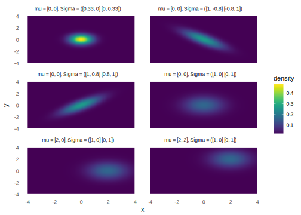

# Multivariate Normal Distribution


```r
library("tidyverse")
library("viridis")
library("mvtnorm")
```


The multivariate normal distribution is the generalization of the univariate normal distribution to more than one dimension.[^mvnorm]
The random variable, $\vec{x}$, is a length $k$ vector.
The $k$ length vector $\vec{\mu}$ are the means of $\vec{x}$, and the $k \times k$ matrix, $\mat{\Sigma}$, is the variance-covariance matrix,
$$
\begin{aligned}[t]
\vec{x} &\sim \dmvnorm{k}\left(\vec{\mu}, \mat{\Sigma} \right) \\
\begin{bmatrix}
x_1 \\
x_2 \\
\vdots \\
x_k
\end{bmatrix}
& \sim
\dmvnorm{k}
\left(
  \begin{bmatrix}
  \mu_1 \\
  \mu_2 \\
  \vdots \\
  \mu_k
  \end{bmatrix},
  \begin{bmatrix}
  \sigma_1^2 & \sigma_{1,2} & \cdots & \sigma_{1, k} \\
  \sigma_{2,1} & \sigma_2^2 & \cdots & \sigma_{2, k} \\
  \vdots & \vdots & \ddots & \vdots \\
  \sigma_{k,1} & \sigma_{k,2} & \cdots & \sigma_{k, k}
  \end{bmatrix}
\right)
\end{aligned}
$$
The density function of the multivariate normal is,
$$
p(\vec{x}; \vec{\mu}, \mat{\Sigma}) =
(2 k)^{-\frac{k}{2}}
\left| \mat{\Sigma} \right|^{-\frac{1}{2}}
\exp \left( -\frac{1}{2} (\vec{x} - \vec{\mu})\T \mat{\Sigma}^{-1} (\vec{x} - \vec{\mu}) \right) .
$$

You can sample from and calculate the density for the multivariate normal distribution with the functions `dmvnorm` and `rmvnorm` from the package **mvtnorm**.

Density plots of different bivariate normal distributions,


<!-- TODO: plotly surface plots -->

[^mvnorm]: See [Multivariate normal distribution](https://en.wikipedia.org/wiki/Multivariate_normal_distribution) and references therein.
