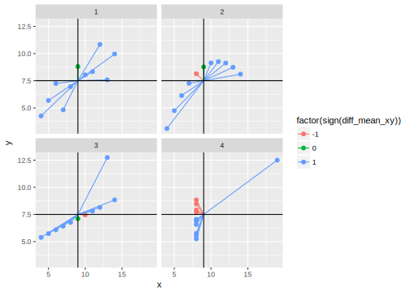

# Miscellaneous Regression Stuff


```r
library("tidyverse")
library("stringr")
```


## Anscombe quartet


```r
anscombe_tidy <-
  anscombe %>%
  mutate(obs = row_number()) %>%
  gather(variable_dataset, value, -obs) %>%
  separate(variable_dataset, c("variable", "dataset"), sep = c(1)) %>%
  spread(variable, value) %>%
  arrange(dataset, obs)
```

What are summary statistics of the four Anscombe datasets?

```r
ggplot(anscombe_tidy, aes(x = x, y = y)) +
  geom_point() + 
  geom_smooth(method = "lm", se = FALSE) +
  facet_wrap(~ dataset, ncol = 2)
```


What are the mean, standard deviation, correlation coefficient, and regression
coefficients of each line? 

```r
anscombe_summ <-
  anscombe_tidy %>%
  group_by(dataset) %>%
  summarise(
    mean_x = mean(x),
    mean_y = mean(y),
    sd_x = sd(x),
    sd_y = sd(y),
    cov = cov(x, y),
    cor = cor(x, y),
    coefs = list(coef(lm(y ~ x, data = .)))
  ) %>%
  mutate(
    intercept = map_dbl(coefs, "(Intercept)"),
    slope = map_dbl(coefs, "x")
  ) %>%
  select(-coefs)
```

WUT? They are the same? But they look so different. Of course that was the point ...

Since this all revolves around covariance, lets calculate the values of $x_i - \bar{x}$,
$y_i - \bar{y}$, and $(x_i - \bar{x}) (y_i - \bar{y})$ for each obs for each variable.

```r
anscombe_tidy <-
  anscombe_tidy %>%
  group_by(dataset) %>%
  mutate(mean_x = mean(x),
         diff_mean_x = x - mean_x,
         mean_y = mean(y),
         diff_mean_y = y - mean_y,
         diff_mean_xy = diff_mean_x * diff_mean_y,
         quadrant = 
           if_else(
             diff_mean_x > 0, 
             if_else(diff_mean_y > 0, 1, 2),
             if_else(diff_mean_y > 0, 4, 3),
           ))
```


```r
ggplot(anscombe_tidy, aes(x = x, y = y,
                          size = abs(diff_mean_xy),
                          colour = factor(sign(diff_mean_xy)))) +
  geom_point() +
  geom_hline(data = anscombe_summ,
             aes(yintercept = mean_y)) +
  geom_vline(data = anscombe_summ,
             aes(xintercept = mean_x)) +  
  facet_wrap(~ dataset, ncol = 2)
```


```r
ggplot(anscombe_tidy, aes(x = x, y = y, colour = factor(sign(diff_mean_xy)))) +
  geom_point() +
  geom_segment(mapping = aes(xend = mean_x, yend = mean_y)) +
  geom_hline(data = anscombe_summ,
             aes(yintercept = mean_y)) +
  geom_vline(data = anscombe_summ,
             aes(xintercept = mean_x)) + 
  facet_wrap(~ dataset, ncol = 2)
```




```r
ggplot(anscombe_tidy, aes(x = x, y = y, colour = factor(sign(diff_mean_xy)))) +
  geom_point() +
  geom_segment(mapping = aes(xend = x, yend = mean_y)) +
  geom_segment(mapping = aes(xend = mean_x, yend = y)) +  
  geom_hline(data = anscombe_summ,
             aes(yintercept = mean_y)) +
  geom_vline(data = anscombe_summ,
             aes(xintercept = mean_x)) +  
  facet_wrap(~ dataset, ncol = 2)
```


## Correlation Plots


<a title="By DenisBoigelot, original uploader was Imagecreator (Own work, original uploader was Imagecreator) [CC0], via Wikimedia Commons" href="https://commons.wikimedia.org/wiki/File%3ACorrelation_examples2.svg"></a>
