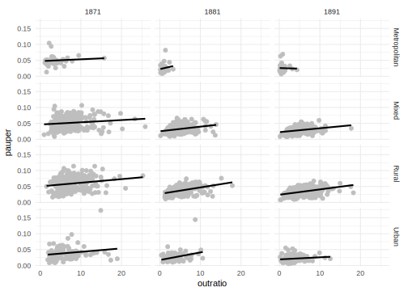
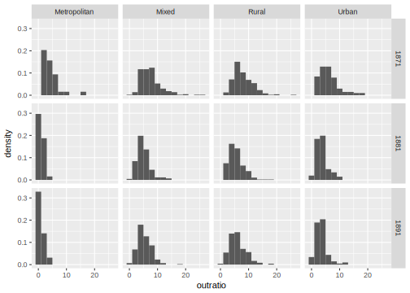
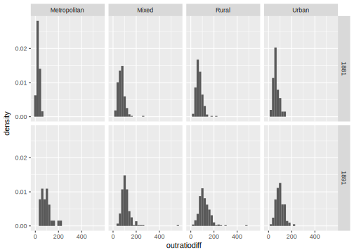
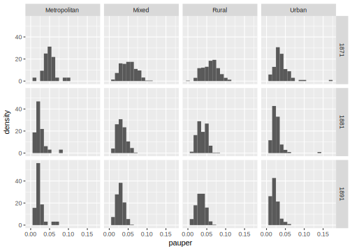
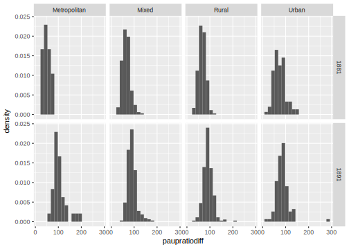
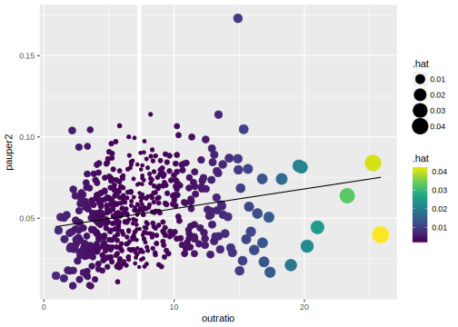

# Yule Pauperism Data


```r
library("tidyverse")
library("modelr")
```

```
## 
## Attaching package: 'modelr'
```

```
## The following object is masked from 'package:broom':
## 
##     bootstrap
```

```r
library("viridis")
library("broom")
```


The Yule Pauperism data is included in the package **datums** at [jrnold/datums](https://github.com/jrnold/datums).

@Yule1899a was the published example multiple regression analysis in its modern form.[^yule]

Yule wrote this paper to analyze the effect of policy changes and implementation on pauperism (poor receiving benefits) in England.
under the [https://en.wikipedia.org/wiki/English_Poor_Laws](Poor Laws).
In 1834, a [new poor law](https://en.wikipedia.org/wiki/Poor_Law_Amendment_Act_1834) was passed that established a national welfare system in England and Wales. 
The New Poor Law created new administrative districts, Poor Law Unions, to adminster the law.
Most importantly, it attempted to standardize the provision of aid to the poor. 
There were two types of aid provided: in-relief, aid provided to paupers in workhouses where
they resided, and out-relief, aid provided to paupers residing at home.
The New Poor Law wanted to decrease in-relief and increase out-relief in the belief
that out-relief, in particular the quality of life in workhouses, was a deterrence to poverty and an encouragement for the poor to work harder to avoid poverty.


[^yule]: See @Stigler2016a and @Stigler1990a for a discussion.

The data in **datums** is 

It consists of two datasets: `pauperism_plu` contains data on the Poor Law Unions,
while `pauperism_year` has the PLU, year as the unit of observation and contains
data on the levels of pauperism in 1871, 1881, and 1891 in each PLU.


```r
library("tidyverse")
# install_github/jrnold
pauperism_plu <- datums::pauperism_plu
pauperism_year <- datums::pauperism_year
```


```r
glimpse(pauperism_year)
```

Instead of taking differences, or percentages. 
Yule worked with "percent ratio differences",
$100 \times x_t / x_{t - 1}$, because he did not want to work with negative signs, presumably a concern at the because he was doing arithmetic by hand and this would make calculations more tedious or error-prone.

```r
pctratiodiff <- function(x) {
  z <- 100 * (x / lag(x))
  z[is.infinite(z)] <- NA_real_
  z
}
```


```r
pauperism <-
  pauperism_year %>%
  mutate(Popn65 = F65 + M65,
         Prop65 = Popn65 / Popn,
         year = as.integer(year)) %>%
  arrange(ID, year) %>%
  group_by(ID) %>%
  mutate(Prop65_diff = pctratiodiff(Prop65)) %>%
  left_join(pauperism_plu, by = "ID") %>%
  filter(Type != "NaN") %>%
  ungroup()
```

Table 1. of pauperism

```r
pauperism %>% 
  filter(year >= 1881) %>%
  select(ID, year, Type, paupratiodiff, outratiodiff, Prop65_diff, popratiodiff) %>%
  drop_na() %>%
  count(year, Type)
```

```
## Source: local data frame [8 x 3]
## Groups: year [?]
## 
##    year         Type     n
##   <int>        <chr> <int>
## 1  1881 Metropolitan    32
## 2  1881        Mixed   217
## 3  1881        Rural   238
## 4  1881        Urban   101
## 5  1891 Metropolitan    32
## 6  1891        Mixed   218
## 7  1891        Rural   239
## 8  1891        Urban   103
```

The number of districts is different, but I'm not sure why.

Table 2: Metropolitan Group, 1871-1881

```r
filter(pauperism, Type == "Metropolitan") %>%
  filter(year == 1881) %>%
  select(ID, Union, paupratiodiff, outratiodiff, Prop65_diff, popratiodiff) %>%
  arrange(ID) %>%
  ungroup() %>%
  select(-ID) %>%
  knitr::kable()
```


Union                   paupratiodiff   outratiodiff   Prop65_diff   popratiodiff
---------------------  --------------  -------------  ------------  -------------
Kensington                   27.02455       4.709511     104.24513      135.62124
Fulham                       30.55314      20.691155      85.41113      173.89046
Paddington                   47.13245      12.820014     115.12124      110.74752
Chelsea                      64.00997      20.957361      80.78122      123.96855
StGeorge                     46.26695      18.696592     113.18960       96.03171
Westminster                  52.01266      26.439934     104.88340       90.94977
StMarylebone                 81.13188      35.865384      99.68465       97.27228
StJohnHampstead              60.85194      38.687664     102.89827      140.80109
StPancras                    60.55554      34.762259     101.01971      106.67961
StMaryIslington              59.22427      34.920438     100.83279      132.31717
Hackney                      33.04587      21.644359      91.27279      149.22810
StGGBloomsbury               75.50703      29.319882     102.77106       84.73747
Strand                       63.99014      26.916741      96.73724       81.41880
Holborn                      78.52338      33.517874      94.42741       93.09890
CityLondon                   78.66401      64.365584     112.37948       67.80155
StLeonardShoreditch          51.70655      20.521901     108.23606       99.54940
BethnalGreen                 46.38214      19.192527     101.73429      105.70922
Whitechapel                  35.30723       6.246978      92.03899       94.45547
StGeorgeEast                 36.67330       6.135770      99.03527       98.13743
Stepney                      33.86640       9.516070      87.06120      101.47859
MileEndOldTown               42.59398      13.266601     102.07680      113.37706
Poplar                       38.50528      19.930617     102.62700      134.48649
StSaviourSouthwark           52.46445      22.451416      99.60833      111.49107
StOlaveSouthwark             56.83153      32.200945     102.36756      109.99526
Lambeth                      56.46941      38.253650      98.30586      121.77045
WandsworthandClapham         23.21714      17.946851      90.69907      168.26643
Camberwell                   29.90475      13.835835      82.55591      167.63966
Greenwich                    54.65175      37.920863      93.50556      130.45030
Woolwich                     76.97900      15.186659     118.71024      110.17307
Lewisham                     39.55357      27.421469     101.25774      140.71416
Croydon                      47.72780      29.186036     101.44845      142.12133
WestHam                      38.40110      48.914488      85.53301      202.69714

Table 3

```r
pauperism %>%
  filter(year >= 1881) %>%
  select(year, Type, paupratiodiff, outratiodiff, Prop65_diff, popratiodiff) %>%
  drop_na() %>%
  gather(variable, value, -year, -Type) %>%
  group_by(year, Type, variable) %>%
  summarise_at(vars(value), funs(mean, sd)) %>%
  knitr::kable()
```


 year  Type           variable              mean          sd
-----  -------------  --------------  ----------  ----------
 1881  Metropolitan   outratiodiff      25.07636   12.979986
 1881  Metropolitan   paupratiodiff     50.61654   16.303219
 1881  Metropolitan   popratiodiff     119.90865   30.090299
 1881  Metropolitan   Prop65_diff       99.13926    9.176468
 1881  Mixed          outratiodiff      70.81556   27.968580
 1881  Mixed          paupratiodiff     66.39643   17.478868
 1881  Mixed          popratiodiff     110.71895   14.749708
 1881  Mixed          Prop65_diff      100.75271   21.403143
 1881  Rural          outratiodiff      72.19569   27.100992
 1881  Rural          paupratiodiff     66.18899   15.492810
 1881  Rural          popratiodiff      97.61334    7.550125
 1881  Rural          Prop65_diff      103.72348    8.713096
 1881  Urban          outratiodiff      64.57293   25.469154
 1881  Urban          paupratiodiff     73.85648   26.387059
 1881  Urban          popratiodiff     123.32655   34.457872
 1881  Urban          Prop65_diff      106.89375   76.126030
 1891  Metropolitan   outratiodiff      90.84679   42.912778
 1891  Metropolitan   paupratiodiff    104.67066   29.836570
 1891  Metropolitan   popratiodiff     111.31099   24.296891
 1891  Metropolitan   Prop65_diff      107.59174    5.524179
 1891  Mixed          outratiodiff     109.63868   45.965573
 1891  Mixed          paupratiodiff     91.09768   19.467070
 1891  Mixed          popratiodiff     108.46061   12.832222
 1891  Mixed          Prop65_diff      106.87802   18.705844
 1891  Rural          outratiodiff     116.88662   48.513561
 1891  Rural          paupratiodiff     91.59067   20.409368
 1891  Rural          popratiodiff      97.44270    6.741761
 1891  Rural          Prop65_diff      107.54229    8.369285
 1891  Urban          outratiodiff      97.18114   33.819458
 1891  Urban          paupratiodiff     86.23436   29.512905
 1891  Urban          popratiodiff     119.53807   31.484939
 1891  Urban          Prop65_diff      116.51129   95.171090

Table 4: Correlations of Percentage Ratios

```r
pauperism %>%
  filter(year >= 1881) %>%
  select(year, Type, paupratiodiff, outratiodiff, Prop65_diff, popratiodiff) %>%
  drop_na() %>%
  group_by(year, Type) %>%
  do({
    cor(.[ , c("paupratiodiff", "outratiodiff", "Prop65_diff", "popratiodiff")]) %>%
      tidy() %>%
      gather(.colnames, value, -.rownames) %>%
      filter(.rownames < .colnames) %>%
      unite(variable, .rownames, .colnames) %>%
      spread(variable, value)
  })
```

```
## Source: local data frame [8 x 8]
## Groups: year, Type [8]
## 
##    year         Type outratiodiff_paupratiodiff outratiodiff_popratiodiff
##   <int>        <chr>                      <dbl>                     <dbl>
## 1  1881 Metropolitan                  0.5731816             -0.0092212754
## 2  1881        Mixed                  0.3173784              0.0776315386
## 3  1881        Rural                  0.4140595             -0.0602981249
## 4  1881        Urban                  0.6561705              0.0898857241
## 5  1891 Metropolitan                  0.5151787              0.2268864595
## 6  1891        Mixed                  0.3717615              0.0488693203
## 7  1891        Rural                  0.5034687              0.0003006584
## 8  1891        Urban                  0.2814298             -0.0159747065
## # ... with 4 more variables: outratiodiff_Prop65_diff <dbl>,
## #   paupratiodiff_popratiodiff <dbl>, paupratiodiff_Prop65_diff <dbl>,
## #   popratiodiff_Prop65_diff <dbl>
```


$$
\begin{aligned}[t]
\Delta\mathtt{Paup} &= \beta_0  \\
          &+ \beta_1 \Delta\mathtt{Out} \\
          &+ \beta_2 \Delta\mathtt{Old} \\
          &+ \beta_3 \Delta\mathtt{Pop} + \varepsilon
\end{aligned}
$$

## Summary Statistics


```r
filter(pauperism, year > 1871) %>%
  ungroup() %>%
  count(year, Type)
```

```
## Source: local data frame [8 x 3]
## Groups: year [?]
## 
##    year         Type     n
##   <int>        <chr> <int>
## 1  1881 Metropolitan    32
## 2  1881        Mixed   220
## 3  1881        Rural   240
## 4  1881        Urban   103
## 5  1891 Metropolitan    32
## 6  1891        Mixed   220
## 7  1891        Rural   240
## 8  1891        Urban   103
```


```r
filter(pauperism, year > 1871) %>%
  filter(Type != "NaN") %>%
  group_by(year, Type) %>%
  select(paupratiodiff, outratiodiff, Prop65_diff, popratiodiff) %>%
  gather(variable, value, -Type, -year) %>%
  group_by(variable, year, Type) %>%
  summarize(mean = mean(value, na.rm = TRUE),
            sd = sd(value, na.rm = TRUE)) %>%
  knitr::kable()
```

```
## Adding missing grouping variables: `year`, `Type`
```


variable         year  Type                 mean          sd
--------------  -----  -------------  ----------  ----------
outratiodiff     1881  Metropolitan     25.07636   12.979986
outratiodiff     1881  Mixed            70.71569   27.942993
outratiodiff     1881  Rural            72.24664   27.055468
outratiodiff     1881  Urban            64.57293   25.469154
outratiodiff     1891  Metropolitan     90.84679   42.912778
outratiodiff     1891  Mixed           109.82761   45.945173
outratiodiff     1891  Rural           116.73896   48.465973
outratiodiff     1891  Urban            97.18114   33.819458
paupratiodiff    1881  Metropolitan     50.61654   16.303219
paupratiodiff    1881  Mixed            66.46855   17.471028
paupratiodiff    1881  Rural            66.18899   15.492810
paupratiodiff    1881  Urban            73.85648   26.387059
paupratiodiff    1891  Metropolitan    104.67066   29.836570
paupratiodiff    1891  Mixed            91.09768   19.467070
paupratiodiff    1891  Rural            91.59067   20.409368
paupratiodiff    1891  Urban            86.23436   29.512905
popratiodiff     1881  Metropolitan    119.90865   30.090299
popratiodiff     1881  Mixed           110.65842   14.706062
popratiodiff     1881  Rural            97.55477    7.546160
popratiodiff     1881  Urban           124.81552   36.422994
popratiodiff     1891  Metropolitan    111.31099   24.296891
popratiodiff     1891  Mixed           108.01843   14.739470
popratiodiff     1891  Rural            97.03669    9.209995
popratiodiff     1891  Urban           119.53807   31.484939
Prop65_diff      1881  Metropolitan     99.13926    9.176468
Prop65_diff      1881  Mixed           100.71849   21.359748
Prop65_diff      1881  Rural           103.74897    8.703695
Prop65_diff      1881  Urban           106.89375   76.126030
Prop65_diff      1891  Metropolitan    107.59174    5.524179
Prop65_diff      1891  Mixed           106.87802   18.705844
Prop65_diff      1891  Rural           107.54229    8.369285
Prop65_diff      1891  Urban           116.51129   95.171090


## Regressions


```r
lm(pauper ~ outratio, data = pauperism)
```

```
## 
## Call:
## lm(formula = pauper ~ outratio, data = pauperism)
## 
## Coefficients:
## (Intercept)     outratio  
##    0.024637     0.002408
```

```r
lm(pauper ~ year + Type + outratio, data = pauperism)
```

```
## 
## Call:
## lm(formula = pauper ~ year + Type + outratio, data = pauperism)
## 
## Coefficients:
## (Intercept)         year    TypeMixed    TypeRural    TypeUrban  
##   1.8736845   -0.0009799   -0.0014571    0.0038099   -0.0083008  
##    outratio  
##   0.0014681
```

```r
lm(pauper ~ year + Type + outratio + Prop65 + Popn65, data = pauperism)
```

```
## 
## Call:
## lm(formula = pauper ~ year + Type + outratio + Prop65 + Popn65, 
##     data = pauperism)
## 
## Coefficients:
## (Intercept)         year    TypeMixed    TypeRural    TypeUrban  
##   1.999e+00   -1.052e-03   -1.405e-02   -1.600e-02   -1.099e-02  
##    outratio       Prop65       Popn65  
##   1.417e-03    4.421e-01   -1.301e-06
```

```r
lm(pauper ~ Type * (year + outratio + Prop65 + Popn65), data = pauperism)
```

```
## 
## Call:
## lm(formula = pauper ~ Type * (year + outratio + Prop65 + Popn65), 
##     data = pauperism)
## 
## Coefficients:
##        (Intercept)           TypeMixed           TypeRural  
##          1.515e+00           3.711e-01           1.021e+00  
##          TypeUrban                year            outratio  
##         -3.650e-01          -7.964e-04           2.063e-03  
##             Prop65              Popn65      TypeMixed:year  
##          5.683e-01          -1.790e-06          -2.010e-04  
##     TypeRural:year      TypeUrban:year  TypeMixed:outratio  
##         -5.580e-04           1.958e-04          -8.536e-04  
## TypeRural:outratio  TypeUrban:outratio    TypeMixed:Prop65  
##         -5.522e-04          -6.385e-04          -8.643e-02  
##   TypeRural:Prop65    TypeUrban:Prop65    TypeMixed:Popn65  
##          6.153e-02          -3.845e-01          -2.140e-06  
##   TypeRural:Popn65    TypeUrban:Popn65  
##          2.853e-06           4.012e-07
```


```r
ggplot(filter(pauperism, !is.na(pauper), !is.na(outratio)),
       aes(x = outratio, y = pauper)) +
  geom_point(colour = "gray") +
  geom_smooth(method = "lm", colour = "black", se = FALSE) +
  facet_grid(Type ~ year) +
  theme_minimal()
```




```r
pauperism_diff <-
  pauperism %>%
  filter(year > 1871) %>%
  mutate(year = as.factor(year)) %>%
  select(ID, Union, Type, year, paupratiodiff, outratiodiff, popratiodiff, Prop65_diff) %>%
  drop_na()

lm(paupratiodiff ~ outratiodiff, data = pauperism_diff)
```

```
## 
## Call:
## lm(formula = paupratiodiff ~ outratiodiff, data = pauperism_diff)
## 
## Coefficients:
##  (Intercept)  outratiodiff  
##      51.8476        0.3062
```

```r
lm(paupratiodiff ~ Type * year + outratiodiff, data = pauperism_diff)
```

```
## 
## Call:
## lm(formula = paupratiodiff ~ Type * year + outratiodiff, data = pauperism_diff)
## 
## Coefficients:
##        (Intercept)           TypeMixed           TypeRural  
##            44.9546              5.4525              4.9335  
##          TypeUrban            year1891        outratiodiff  
##            14.3221             39.2040              0.2258  
## TypeMixed:year1891  TypeRural:year1891  TypeUrban:year1891  
##           -23.2685            -23.8930            -34.1886
```

```r
lm(paupratiodiff ~ Type * year + outratiodiff + popratiodiff + Prop65_diff, data = pauperism_diff)
```

```
## 
## Call:
## lm(formula = paupratiodiff ~ Type * year + outratiodiff + popratiodiff + 
##     Prop65_diff, data = pauperism_diff)
## 
## Coefficients:
##        (Intercept)           TypeMixed           TypeRural  
##           76.82129             3.25804            -0.21806  
##          TypeUrban            year1891        outratiodiff  
##           15.33249            37.36729             0.22808  
##       popratiodiff         Prop65_diff  TypeMixed:year1891  
##           -0.23418            -0.03878           -21.81233  
## TypeRural:year1891  TypeUrban:year1891  
##          -22.05079           -32.94109
```

```r
lm(paupratiodiff ~ (Type * year) * (outratiodiff + Prop65_diff + popratiodiff), data = pauperism_diff)
```

```
## 
## Call:
## lm(formula = paupratiodiff ~ (Type * year) * (outratiodiff + 
##     Prop65_diff + popratiodiff), data = pauperism_diff)
## 
## Coefficients:
##                     (Intercept)                        TypeMixed  
##                       5.777e+01                       -6.535e+00  
##                       TypeRural                        TypeUrban  
##                      -8.292e+01                       -2.639e+00  
##                        year1891                     outratiodiff  
##                      -7.264e+01                        7.082e-01  
##                     Prop65_diff                     popratiodiff  
##                       1.082e-01                       -2.973e-01  
##              TypeMixed:year1891               TypeRural:year1891  
##                       1.607e+02                        7.619e+01  
##              TypeUrban:year1891           TypeMixed:outratiodiff  
##                       1.310e+02                       -5.095e-01  
##          TypeRural:outratiodiff           TypeUrban:outratiodiff  
##                      -4.775e-01                       -2.505e-02  
##           TypeMixed:Prop65_diff            TypeRural:Prop65_diff  
##                      -9.975e-02                        3.717e-01  
##           TypeUrban:Prop65_diff           TypeMixed:popratiodiff  
##                      -1.675e-01                        2.994e-01  
##          TypeRural:popratiodiff           TypeUrban:popratiodiff  
##                       5.524e-01                        1.428e-01  
##           year1891:outratiodiff             year1891:Prop65_diff  
##                      -3.761e-01                        1.102e+00  
##           year1891:popratiodiff  TypeMixed:year1891:outratiodiff  
##                      -6.927e-02                        3.356e-01  
## TypeRural:year1891:outratiodiff  TypeUrban:year1891:outratiodiff  
##                       3.612e-01                       -7.082e-02  
##  TypeMixed:year1891:Prop65_diff   TypeRural:year1891:Prop65_diff  
##                      -1.292e+00                       -9.311e-01  
##  TypeUrban:year1891:Prop65_diff  TypeMixed:year1891:popratiodiff  
##                      -1.073e+00                       -3.577e-01  
## TypeRural:year1891:popratiodiff  TypeUrban:year1891:popratiodiff  
##                      -8.724e-04                       -1.660e-01
```


## Summary Statistics

### Outratio


```r
ggplot(select(filter(pauperism, !is.na(outratio)),
              outratio, ID, year, Type),
       aes(x = outratio, y = ..density..)) +
  geom_histogram(binwidth = 2) +
  facet_grid(year ~ Type)
```




```r
ggplot(select(filter(pauperism, !is.na(outratiodiff)),
              outratiodiff, ID, year, Type),
       aes(x = outratiodiff, y = ..density..)) +
  geom_histogram(binwidth = 20) +
  facet_grid(year ~ Type)
```



## Pauperism


```r
ggplot(select(filter(pauperism, !is.na(pauper)),
              pauper, ID, year, Type),
       aes(x = pauper, y = ..density..)) +
  geom_histogram(binwidth = .01) +
  facet_grid(year ~ Type)
```



There appear to be some big outliers in the ratio difference
in pauperism,

```r
ggplot(select(filter(pauperism, !is.na(paupratiodiff)),
              paupratiodiff, ID, year, Type),
       aes(x = paupratiodiff, y = ..density..)) +
  geom_histogram(binwidth = 15) +
  facet_grid(year ~ Type)
```




## Specifications

Dependent variable

- proportion paupers
- number paupers
- log(paupers)
- log(proportion paupers)

Controlling for various:

- outratio, inratio
- population
  - number
  - log(number)
  
- proportion 65+
  - proportion
  - number
  - log(number)


```r
datums::pauperism_year %>%
  filter(year == 1871) %>%  
  select(outratio, pauper2) %>%
  drop_na() %>%
  ggplot(aes(x = outratio, pauper2)) +
  geom_point() + 
  geom_smooth(method = "lm")
```


```r
datums::pauperism_year %>%
  filter(year == 1871) %>%  
  select(outratio, pauper2) %>%
  drop_na() %>%
  cor()
```

```
##           outratio   pauper2
## outratio 1.0000000 0.2105665
## pauper2  0.2105665 1.0000000
```

Regressions for each year

```r
datums::pauperism_year %>%
  group_by(year) %>%
  summarise(mod = list(lm(outratio ~ pauper2, data = .)))
```

```
## # A tibble: 3 × 2
##    year      mod
##   <int>   <list>
## 1  1871 <S3: lm>
## 2  1881 <S3: lm>
## 3  1891 <S3: lm>
```


```r
datums::pauperism_year %>%
  filter(year == 1871) %>%
  select(outratio, pauper2) %>%
  drop_na() %>%
  lm(pauper2 ~ outratio, data = .)
```

```
## 
## Call:
## lm(formula = pauper2 ~ outratio, data = .)
## 
## Coefficients:
## (Intercept)     outratio  
##    0.043637     0.001218
```


```r
mod_1871 <-
  datums::pauperism_year %>%
  filter(year == 1871) %>%
  select(outratio, pauper2) %>%
  {lm(pauper2 ~ outratio, data = .)}

ggplot(augment(mod_1871), aes(x = outratio)) +
  geom_ref_line(v = mean(filter(pauperism_year, year == 1871)$outratio, na.rm = TRUE)) +
  geom_point(mapping = aes(y = pauper2, size = .hat, colour = .hat)) +
  geom_path(mapping = aes(y = .fitted)) +
  scale_color_viridis()
```



The observations that have the highest weight in determining the fitted values are those furthest from the mean of `X`.


Hat values in multidimensional space:

```r
# MDS 
pauperism_mds <-
  pauperism %>%
  filter(year == 1891) %>%
  select(outratiodiff, popratiodiff, Prop65_diff) %>%
  drop_na() %>%
  dist() %>%
  cmdscale() %>%
  tidy()

lm(paupratiodiff ~ outratiodiff + popratiodiff + Prop65_diff,
  data = filter(pauperism, year == 1891)) %>%
  augment() %>%
  bind_cols(pauperism_mds) %>%
  ggplot(aes(x = X1, y = X2, size = .hat, colour = .hat)) +
  geom_ref_line(h = 0) +
  geom_ref_line(v = 0) +
  geom_point()
```


## Multiple regression  anatomy

$$
\beta_k = \frac{\Cov(Y_i, \tilde{X}_{k,i})}{\Var{\tilde{X}_{ki}}}
$$
where $\tidle{X}_{ki}$ is the residual of the regression of $X$ on all the variables other than $K$.


Regress `paupratio` on `Prop65_diff`:

```r
pauperism_diff <- select(pauperism, paupratiodiff, outratiodiff, 
                         Prop65_diff, popratiodiff) %>%
  drop_na()
mod_prop65_diff <- lm(paupratiodiff ~ Prop65_diff, data = pauperism_diff)
pauperism_diff$.fitted1 <- fitted(mod_prop65_diff)
pauperism_diff$.resid1 <- residuals(mod_prop65_diff)
```


```r
mod_popratiodiff <- lm(.resid1 ~ popratiodiff, data = pauperism_diff)
pauperism_diff$.fitted2 <- fitted(mod_popratiodiff)
pauperism_diff$.resid2 <- residuals(mod_popratiodiff)
```

Regress residuals on `outratiodiff`

```r
mod_popratiodiff <- lm(.resid2 ~ outratiodiff, data = pauperism_diff)
pauperism_diff$.fitted3 <- fitted(mod_popratiodiff)
pauperism_diff$.resid3 <- residuals(mod_popratiodiff)
```


- Relationship between the omitted variables $Z$ and $X$
- Relationship between the omitted variable and $Y$

OVB formula. @AngristPischke2014a [p. 70]

- Effect of $X$  in short = Effect of $X$ in long + (Relationship between included and omitted) x effect of omitted in long.
- OVB = (Relationship between $X$ and $Z$) x (effect of $Z$ in long)


