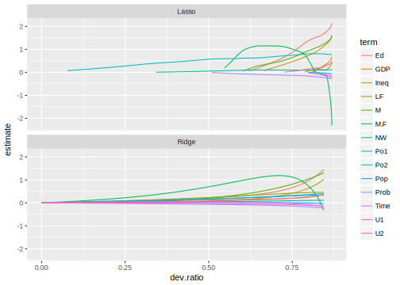

# Regularization


```r
library("glmnet")
library("tidyverse")
library("broom")
```


```r
UScrime <- MASS::UScrime %>%
  mutate_at(vars(y, M, Ed, Po1, Po2, LF, M.F, Pop,
                 NW, U1, U2, GDP, Ineq, Prob, Time),
            funs(log))

varlist <- c("M", "Ed", "Po1", "Po2", "LF", "M.F", "Pop", "NW",
             "U1", "U2", "GDP", "Ineq", "Prob", "Time")
```

By default, `glmnet` will return and entire range of coefficients.

```r
mod_lasso <- glmnet(as.matrix(UScrime[, varlist]), UScrime[["y"]])
mod_ridge <- glmnet(as.matrix(UScrime[, varlist]), UScrime[["y"]], alpha = 0)     
```


```r
bind_rows(
  mutate(tidy(mod_lasso), model = "Lasso"),
  mutate(tidy(mod_ridge), model = "Ridge")
) %>%
  filter(term != "(Intercept)") %>%
  ggplot(aes(x = dev.ratio, y = estimate, colour = term)) +
  geom_line() +
  facet_wrap(~ model, ncol = 1)
```



Alternatively, the lasso and ridge regression models are the solutions to the problems
$$
\hat{\beta}_{\text{lasso}} = \arg \min_\beta \left\{  \sum_{i =1}^n \left(y_i - \beta_0 - \sum_{j = 1}^p \beta_j x_{ij} \right)^{2} \right\} \text{s.t.} \sum_{j = 1}^p \beta_j^2 \leq c, 
$$
and
$$
\begin{aligned}[t]
\hat{\beta}_{\text{lasso}} &= \arg \min_\beta \left\{  \sum_{i =1}^n \left(y_i - \beta_0 - \sum_{j = 1}^p \beta_j x_{ij} \right)^{2} \right\} \\
\text{s.t.}& \sum_{j = 1}^p |\beta_j| \leq c
\end{aligned}
$$

In other words, these methods try to find the $\Vec{\beta}$ with the smallest sum of squared errore that has a $\Vec{\beta}$ with a norm less than $c$.
The value of $c$ corresponds to some value of $\lambda$ in the previous methods.

Think of $c$ as a fixed *budget*. The lasso and ridge regressions try to find the variables that explain $y$ the best without going over the budget.[@ISLR, p. 221]

Consider the case with only coefficients: $\beta_1$ and $\beta_2$.
In the lasso, we want to find the values of $\beta_1$ and $\beta_2$
$$
|\beta_1| + |\beta_2| \leq c
$$


=======
> never trust OLS with more than five regressors
> --- [Zvi Grilliches](http://www.nber.org/econometrics_minicourse_2015/nber_slides11.pdf)
>
> Regularization theory was one of the first signs of the existence of intelligent inference
> --- [Zapnik](http://www.nber.org/econometrics_minicourse_2015/nber_slides11.pdf)

Rather than choose the best fit, there is some penalty to avoid over-fitting.
This is to choose the optimal optimal point on the expected predicted value.

There are two questions

1.  method of regularization
1.  amount of regularization

There are several choices of the former, chosen for different reasons.

The latter is almost always chosen by cross-validation.

While OLS is okay for estimating $\beta$ (best linear unbiased property).
However, with $K \geq 3$ regressors, OLS is poor.

The approaches to regularization in regression are

1.  Shrink estimates to zero (Ridge)
1.  Sparsity, limit number of non-zero estimates (Lasso)
1.  Combination of the two (Bridge)

## Ridge Regression

$$
\hat{\beta}_{\text{OLS}} = \arg \min_{\beta} \sum_{i=1}^{n} (y_i - \Vec{x}_{i} \Vec{\beta})^{2}
$$

Regularized regression adds a penalty that is a function of $\beta$.
This encourages $\beta$ to be close to zero.
$$
\hat{\beta}_{\text{regularized}} = \arg \min_{\beta} \sum_{i=1}^{n} (y_i - \Vec{x}_{i} \Vec{\beta})^{2} + \lambda f(\beta)
$$

Where $\lambda$ is a penalty parameter, and $f(\beta)$ is a function that increases in the total magnitudes of the coefficients.

-   $\lambda \to \infty$: all coefficients are zero
-   $\lambda \to 0$: same as OLS

How do we choose the value of $\lambda$? 

-   Currently: cross-validation
-   Historically: there were some default plug-in estimators, especially for ridge regression.

**Ridge** regression penalizes the $\Vec{\beta}$ vector by the 
$$
\hat{\beta}_{\text{ridge}} = \arg \min_{\beta} \sum_{i=1}^{n} (y_i - \Vec{x}_{i} \Vec{\beta})^{2} + \sum_{k = 1}^{p} \beta_k^2
$$

**Lasso** penalizes the coefficients by an the $L1$ norm. 
Suppose we want to find the best subset of $\leq k$ covariates .
$$
\hat{\beta}_{\text{lasso}} = \arg \min_{\beta} \sum_{i=1}^{n} (y_i - \Vec{x}_{i} \Vec{\beta})^{2} + \lambda \sum_{k = 1}^p |\beta_k|
$$

-   If true distribution of coefficients is a few big ones and many small ones, 
    LASSO will do better. If many small/modest sized effects, ridge may do better.

-   LASSO does not work well with highly correlated coefficients.

    -   Ridge: $\hat{\beta}_{1} + \hat{\beta}_{2} \approx (\beta_1 + \beta_2)/ 2$.
    -   LASSO: Indifferent between $\hat{\beta}_1 = 0$, $\hat{\beta}_2 = \beta_1 + \beta_2$, $\hat{\beta}_1 = \beta_1 + \beta_2$, and $\hat{\beta}_2 = 0$.

-   Approximate best-subset selection. Suppose that we would really like to select
    the best subset of $q < k$ coefficients and set the rest to zero (this is the variable selection problem).
    That is a hard problem since there are $\binom{k}{q}$. 
    Lasso can be viewed as an approximation of the problem.

-   Oracle property. If the true model is sufficiently sparse, we can ignore the
    selection stage and use OLS standard errors of the non-zero variables 
    for inference.

**Bridge** regression penalizes the $\Vec{\beta}$ vector by the 
$$
\hat{\beta}_{\text{bridge}} = \arg \min_{\beta} \sum_{i=1}^{n} (y_i - \Vec{x}_{i} \Vec{\beta})^{2} + \lambda_1 \sum_{k = 1}^{p} |\beta_k| + \lambda_2 \sum_{k = 1}^{p} \beta_k^2
$$

Bridge regression has some of the properties of both ridge and Lasso. 
It will select correlated regressors, yet also shrink coefficients to zero for
a sparse solution.

The R package **[glmnet](https://cran.r-project.org/package=glmnet)** is the most commonly used package to estimate 
Lasso, ridge, and bridge regression for linear and generalized linear models.
However, these methods are common enough that all machine learning frameworks
will have some implementation of them.  See other packages for variations on the
lasso that take into account other dependencies in the data.

How to find the value of $\lambda$? Cross validation. 
The function `cv.glmet()` uses cross-validation to select the penalty parameter.

## Regularization for Causal Inference

Belloni, Chernozhukov, and Hansen (2014) propose a simple method for using Lasso 
for causal effects.

What's the problem with regularized regression for causal inference?
Suppose we estimate a model with the aim to recover $\beta_1$.
$$
\Vec{y} = \alpha + \beta x + \gamma_1 z_1 + \cdots + \gamma_k z_{k-1} + \epsilon
$$
If we estimate it with a regularized model, like lasso, then $\beta_1$ will be shrunk in addition to the controls.
If we instead do not shrink $\beta_1$ but we shrink the controls enough. 
It will be closer to **not** controlling for the other variables since any part of 
of the treatment prediction of the outcome explained by the controls will be shrunk since those coefficients are penalized, but the treatment coefficient is not.

1.  Run Lasso with the outcome $y$ on all controls, $z_1, \dots, \z_k$. 
    Keep all non-zero coefficients.

1.  Run Lasso with the treatment $z$ on all controls, $z_1, \dots, z_k$. 
    Keep all non-zero coefficients.

1.  Run OLS with the outcome $y$ on the treatment, $x$, and all variables with 
    a non-zero coefficient in either step 1 or 2.

If the **true model is sparse** (and asymptotics), then by the Oracle property, 
we can treat the standard errors of the OLS coefficients in the last step as
if the selection stage did not occur.

See <https://arxiv.org/pdf/1603.01700.pdf> and the **[hdm](https://cran.r-project.org/package=hdm)** which implements this method, and extensions to work with high dimensional data in R.

## References

It is a few years old, but the [2015 NBER Summer course](http://www.nber.org/econometrics_minicourse_2015/nber_slides11.pdf) has a good introduction to machine learning that is targeted at social scientists.
