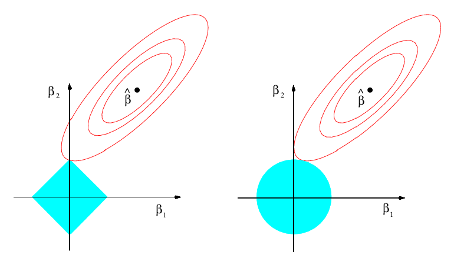

# Regularization


---
title: "Untitled"
author: "Jeffrey Arnold"
date: "4/18/2018"
output: html_document
---

```{r}
library("glmnet")
library("tidyverse")

UScrime <- MASS::UScrime %>%
  mutate_at(vars(y, M, Ed, Po1, Po2, LF, M.F, Pop,
                 NW, U1, U2, GDP, Ineq, Prob, Time),
            funs(log))

varlist <- c("M", "Ed", "Po1", "Po2", "LF", "M.F", "Pop", "NW",
             "U1", "U2", "GDP", "Ineq", "Prob", "Time")
```

By default, `glmnet` will return and entire range of coefficients.
```{r}
mod_lasso <- glmnet(as.matrix(UScrime[, varlist]), UScrime[["y"]])
mod_ridge <- glmnet(as.matrix(UScrime[, varlist]), UScrime[["y"]], alpha = 0)     
```

```{r}
bind_rows(
  mutate(tidy(mod_lasso), model = "Lasso"),
  mutate(tidy(mod_ridge), model = "Ridge")
) %>%
  filter(term != "(Intercept)") %>%
  ggplot(aes(x = dev.ratio, y = estimate, colour = term)) +
  geom_line() +
  facet_wrap(~ model, ncol = 1)
```

Alternatively, the lasso and ridge regression models are the solutions to the problems
$$
\hat{\beta}_{\text{lasso}} = \arg \min_\beta \left\{  \sum_{i =1}^n \left(y_i - \beta_0 - \sum_{j = 1}^p \beta_j x_{ij} \right)^{2} \right\} \text{s.t.} \sum_{j = 1}^p \beta_j^2 \leq c, 
$$
and
$$
\begin{aligned}[t]
\hat{\beta}_{\text{lasso}} &= \arg \min_\beta \left\{  \sum_{i =1}^n \left(y_i - \beta_0 - \sum_{j = 1}^p \beta_j x_{ij} \right)^{2} \right\} \\
\text{s.t.}& \sum_{j = 1}^p |\beta_j| \leq c
\end{aligned}
$$

In other words, these methods try to find the $\Vec{\beta}$ with the smallest sum of squared errore that has a $\Vec{\beta}$ with a norm less than $c$.
The value of $c$ corresponds to some value of $\lambda$ in the previous methods.

Think of $c$ as a fixed *budget*. The lasso and ridge regressions try to find the variables that explain $y$ the best without going over the budget.[@ISLR, p. 221]

Consider the case with only coefficients: $\beta_1$ and $\beta_2$.
In the lasso, we want to find the values of $\beta_1$ and $\beta_2$
$$
|\beta_1| + |\beta_2| \leq c
$$

```{r echo=FALSE}

```
